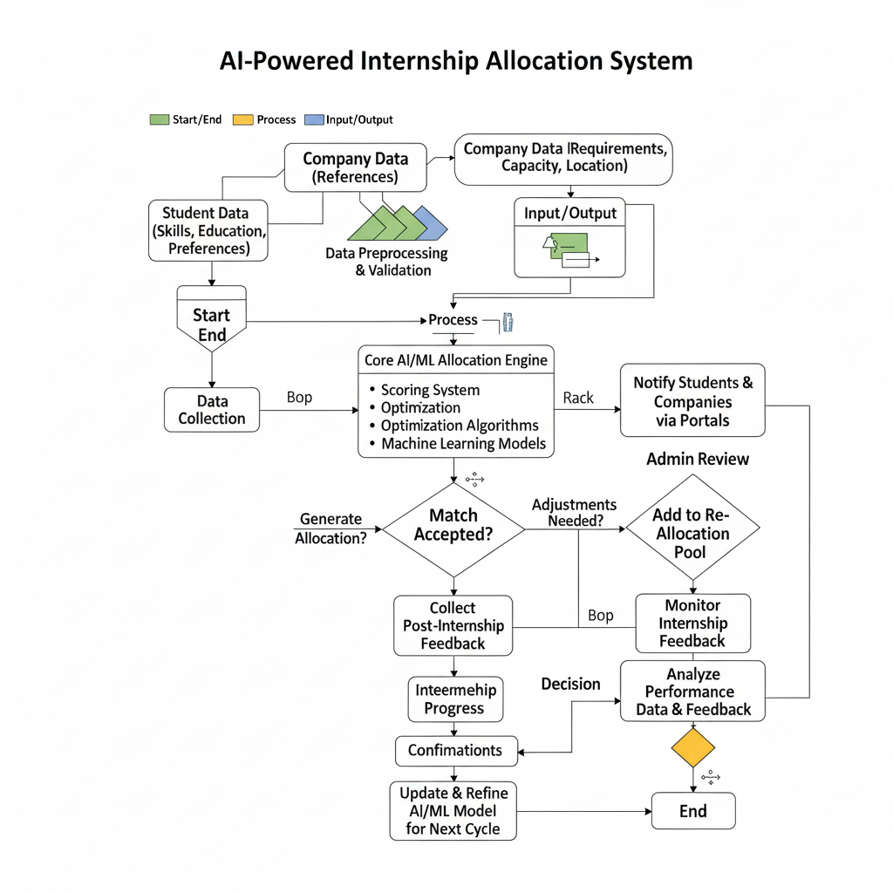

# AI-Based Smart Allocation Engine for PM Internship Scheme (SIH25033)

> **Smart India Hackathon 2025 — Software → Smart Automation**

---




## Overview

The **AI-Based Smart Allocation Engine** automates matching of students to internships under the PM Internship Scheme. It uses scoring, optimization, and AI/ML to make fast, fair, and transparent allocations.

---

## Key Features

* Match students ↔ companies (skills, education, location, preferences).
* AI/ML layer for smarter allocations.
* Handles constraints: seats, eligibility, fairness.
* Automates reallocation for dropouts.
* Dashboards for students, companies, and admins.
* Explanations for why a match was made.

---

## Approach

1. **Data Models**: student + internship info.
2. **Scoring Layer**: weighted scores based on match features.
3. **Optimization**: greedy, Hungarian method, or stable matching.
4. **AI/ML**: predict best fits, dropout risk.
5. **Fairness & Transparency**: quotas, audit logs, explanations.

---

## Example Data

**Student:**

```json
{
  "id": "stu_123",
  "skills": ["python","ml"],
  "location_preferences": ["Bengaluru"]
}
```

**Internship:**

```json
{
  "id": "comp_45",
  "skills_required": ["python","cv"],
  "location": "Bengaluru",
  "seats": 5
}
```

---

## Outputs

* `allocations.json`: `{student_id, company_id, score, explanation}`
* Logs for audits & fairness reports.

---

## Roadmap

1. MVP: scoring + greedy matching.
2. Add reallocation handling.
3. Integrate ML for fit prediction.
4. Add dashboards & fairness audits.
